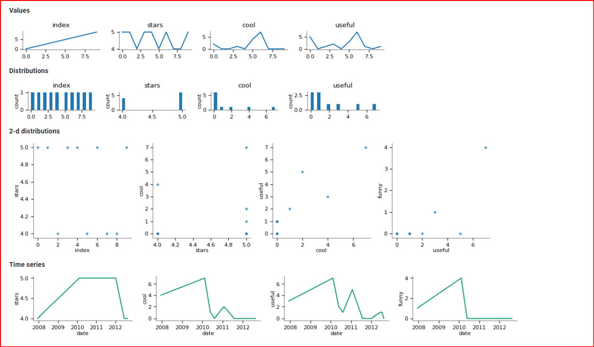
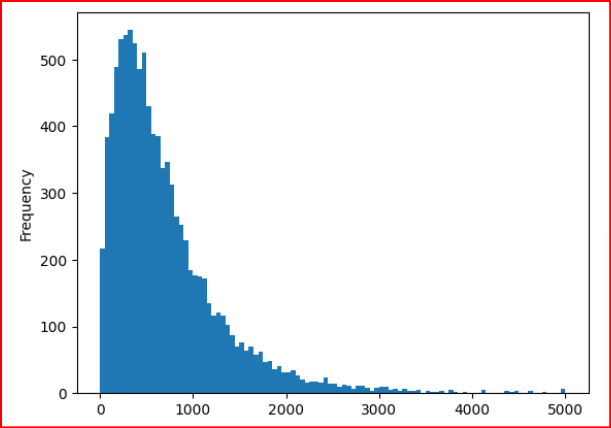
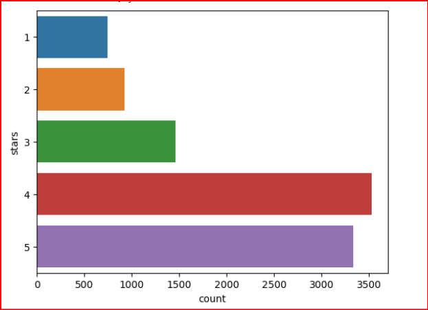

# NLP_yelp_reviews

- **In this project, Natural Language Processing (NLP) strategies will be used to analyze Yelp reviews data**
- **Number of 'stars' indicate the business rating given by a customer, ranging from 1 to 5**
- **'Cool', 'Useful' and 'Funny' indicate the number of cool votes given by other Yelp Users**.

## VISUALIZE DATASET

- **the dataset contains stars cool useful and fancy categories dtypes: int64**
- **the distribution of these data we can see in the above image**.

- **average frequency of the length of the reviews given by any user**.

- **there are mostly 4 and 5 stars reviews compare to the others**

